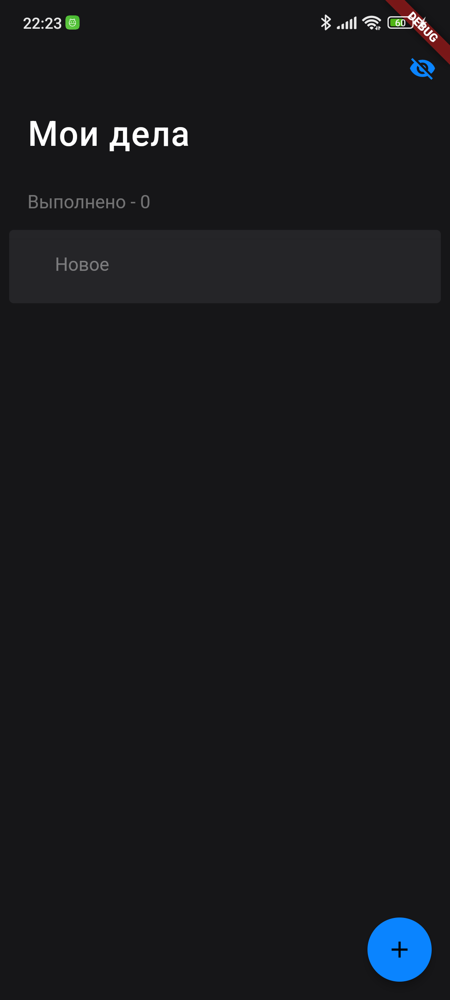
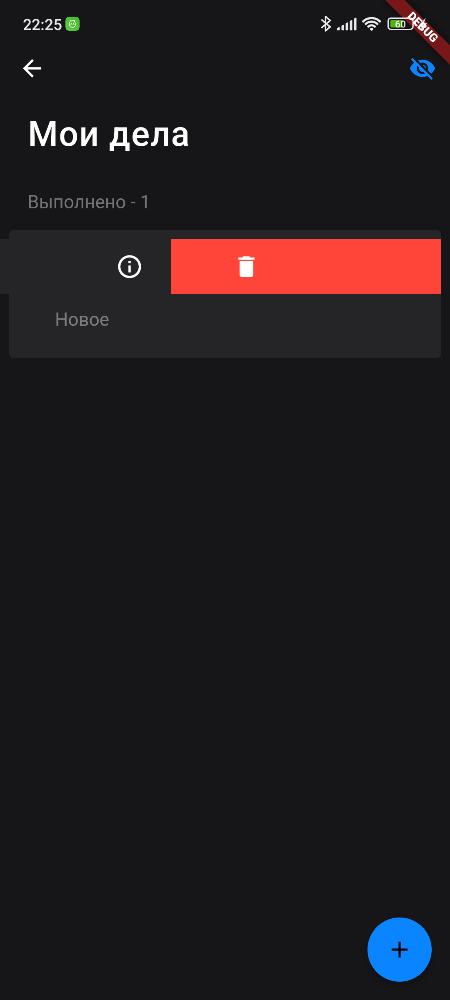
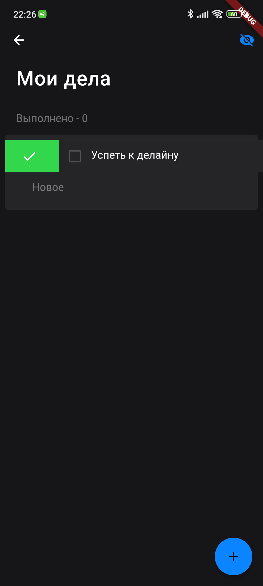

# README

Это проект на Flutter, представляющий собой приложение для управления задачами (TODO). Ниже приведены инструкции по настройке и запуску проекта.

## Предварительные требования

Перед продолжением убедитесь, что у вас установлены следующие программы:

- Flutter SDK: [Инструкция по установке](https://flutter.dev/docs/get-started/install)
- Dart SDK: [Инструкция по установке](https://dart.dev/get-dart)

## Настройка

1. Клонируйте репозито2рий проекта на ваш компьютер с помощью следующей команды:

   ```shell
   git clone <repository_url>
   ```

2. Перейдите в директорию проекта:

   ```shell
   cd <project_directory>
   ```

3. Установите зависимости проекта, выполнив следующую команду:

   ```shell
   flutter pub get
   ```

4. Сгенерируйте необходимые файлы с помощью `build_runner`, выполните следующую команду:

   ```shell
   dart run build_runner build --delete-conflicting-outputs
   ```

## Запуск проекта

После завершения настройки вы можете запустить проект Flutter с помощью следующей команды:

```shell
flutter run
```

Эта команда запустит приложение на подключенном устройстве или эмуляторе.

## Скриншоты

Ниже представлены скриншоты приложения:






## Создание APK-файла

Для создания APK-файла выполните следующие шаги:

1. Введите следующую команду для сборки релизной версии приложения:

   ```shell
   flutter build apk
   ```

2. После успешной сборки вы найдете APK-файл проекта в директории `build/app/outputs/apk/release/app-release.apk`.

Теперь вы можете установить APK-файл на устройстве Android и запустить приложение.